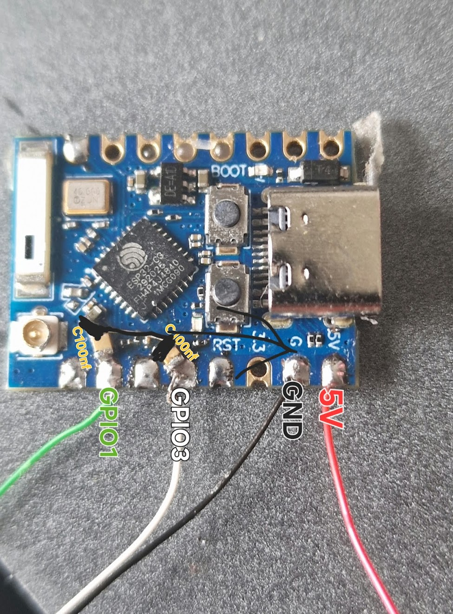

# Legacy Bridge Workspace

## 🌐 Language / Язык / Мова

Открой нужный язык в блоках ниже.

<details open>
<summary><b>English</b></summary>

## 🔥 Legacy Bridge (LB)

An intelligent bridge between a soldering station and a fume extractor.  
Automation without replacing your hardware.

### 🚀 What it is

If your extractor does not start automatically and your tools work as isolated devices, Legacy Bridge connects them into a single automation system.

Legacy Bridge is an external ESP32 module that controls the fume extractor using soldering iron dock state (SENSE) and hot-air activity.

### 📖 Project story

The project was created from real Aixun workflow issues: ES02 had no practical integration with T420D (without Wi-Fi module) and H312.  
Legacy Bridge was built to add compatibility and automation without replacing the station.

### ⚙️ Features

- Automatic extractor start/stop
- SENSE-based iron state logic
- Hot-air trigger by temperature (Wi-Fi / BLE)
- Extractor speed control
- White/green light behavior control
- Start/stop delays
- Web UI + Recovery + OTA

### 🧠 How it works

- ESP32 reads handle and hot-air state
- Logic decides when extractor must run
- Commands are sent to ES02 automatically

### 🧩 Hardware

- ESP32-C3 Pro Mini
- R1, R2 - 100 kOhm
- C1, C2 - 100 nF

<a href="assets/photos/system-overview.jpg" target="_blank"></a>
<a href="assets/photos/esp32-closeup.jpg" target="_blank"></a>
<a href="assets/photos/esp32-wires-capacitors.jpg" target="_blank"></a>
  
*ESP32 wiring (GPIO1, GPIO3, power)*

### 🔌 Wiring

```text
Signal 1 -> R1 100k -> GPIO1
GPIO1    -> C1 100nF -> GND

Signal 2 -> R2 100k -> GPIO3
GPIO3    -> C2 100nF -> GND

5V  -> ESP32 5V
GND -> ESP32 GND
```

<a href="assets/photos/t420d-sense-point-1.jpg" target="_blank"></a>
<a href="assets/photos/t420d-sense-point-2.jpg" target="_blank"></a>
<a href="assets/photos/t420d-5v-point.jpg" target="_blank"></a>
  
*SENSE connection point on station board*  
*5V power source point*

### 🌐 Web interface

The UI is designed for setup-first workflow: configure once, then run daily without manual control.

Practical effect:
- Less unnecessary noise
- Extractor works only when needed
- Lower power waste
- No manual on/off routine

### 📡 First start

Online USB flasher: https://serjio193.github.io/legacy-bridge/  
Demo UI: https://serjio193.github.io/legacy-bridge/demo/  
Use a Chromium browser (Chrome/Edge, WebSerial support).

Default access:
- SSID: `LB-SETUP-XXXXX`
- Password: `lbxxxxx!2026`
- Web login: `admin`
- Recovery AP: `LB_RECOVERY`

`XXXXX` is the last 5 MAC symbols (HEX uppercase), `xxxxx` is lowercase.

### 🔐 Security

- Firmware packages are signed with a private key
- Device installs only valid signed updates
- Bootloader and Recovery are protected from Wi-Fi rewriting

### 📦 Updates

- OTA over Wi-Fi
- Package: `update.lbpack`
- Source: GitHub Releases

### 🧪 Supported equipment

- Aixun T420D
- Aixun H312
- Aixun ES02
- JBC-compatible stations (partial)

### 🚧 Roadmap

- Additional ESP32 slave devices
- Integration with more equipment (Aixun/JCID/etc.)

### 👨‍🔧 Author

Serjio193, embedded developer.  
Built from real repair bench and daily usage requirements.

### 🎯 Goal

Create a simple and reliable tool that automates workflow without replacing existing hardware.

### ❤️ Support

<a href="https://paypal.me/SerhiiTarnopovych" target="_blank">
  
</a>
&nbsp;&nbsp;
<a href="https://serjio193.github.io/legacy-bridge/support.html" target="_blank">
  
</a>

</details>

<details>
<summary><b>Українська</b></summary>

## 🔥 Legacy Bridge (LB)

Інтелектуальний міст між паяльною станцією та димовловлювачем.  
Автоматизація без заміни обладнання.

### 🚀 Що це таке

Якщо витяжка не вмикається автоматично, а інструменти працюють окремо, Legacy Bridge об'єднує їх в одну систему автоматизації.

Це зовнішній модуль на ESP32, що керує димовловлювачем за станом паяльника (SENSE) і фена.

### 📖 Історія проєкту

Проєкт виник з реальних задач під час роботи з обладнанням Aixun: ES02 не мав зручної інтеграції з T420D (без Wi-Fi модуля) та H312.  
Legacy Bridge створений, щоб додати сумісність і автоматизацію без заміни станції.

### ⚙️ Можливості

- Автоматичне вмикання/вимикання димовловлювача
- Логіка по SENSE для ручок
- Тригер фена по температурі (Wi-Fi / BLE)
- Керування потужністю витяжки
- Керування білою/зеленою підсвіткою
- Затримки старту/зупинки
- Web UI + Recovery + OTA

### 🧠 Принцип роботи

- ESP32 читає стан ручок і фена
- Логіка визначає, коли запускати витяжку
- Команди автоматично надсилаються на ES02

### 🧩 Апаратна частина

- ESP32-C3 Pro Mini
- R1, R2 - 100 кОм
- C1, C2 - 100 нФ

<a href="assets/photos/system-overview.jpg" target="_blank"></a>
<a href="assets/photos/esp32-closeup.jpg" target="_blank"></a>
<a href="assets/photos/esp32-wires-capacitors.jpg" target="_blank"></a>
  
*Підключення ESP32 (GPIO1, GPIO3, живлення)*

### 🔌 Схема підключення

```text
Signal 1 -> R1 100k -> GPIO1
GPIO1    -> C1 100nF -> GND

Signal 2 -> R2 100k -> GPIO3
GPIO3    -> C2 100nF -> GND

5V  -> ESP32 5V
GND -> ESP32 GND
```

<a href="assets/photos/t420d-sense-point-1.jpg" target="_blank"></a>
<a href="assets/photos/t420d-sense-point-2.jpg" target="_blank"></a>
<a href="assets/photos/t420d-5v-point.jpg" target="_blank"></a>
  
*Точка підключення SENSE на платі станції*  
*Джерело живлення 5V*

### 🌐 Веб-інтерфейс

UI орієнтований на сценарій "налаштував і працює": один раз виставив логіку, далі система працює автономно.

Що це дає:
- Менше зайвого шуму
- Витяжка працює лише за потреби
- Менше витрат електроенергії
- Не потрібно вручну вмикати/вимикати

### 📡 Перший запуск

Онлайн USB flasher: https://serjio193.github.io/legacy-bridge/  
Demo UI: https://serjio193.github.io/legacy-bridge/demo/  
Потрібен Chromium браузер (Chrome/Edge, WebSerial).

Дані за замовчуванням:
- SSID: `LB-SETUP-XXXXX`
- Пароль: `lbxxxxx!2026`
- Логін: `admin`
- Recovery AP: `LB_RECOVERY`

`XXXXX` - останні 5 символів MAC (HEX uppercase), `xxxxx` - ті самі символи lowercase.

### 🔐 Безпека

- Пакети прошивки підписані приватним ключем
- Пристрій встановлює лише валідно підписані оновлення
- Bootloader та Recovery захищені від перезапису по Wi-Fi

### 📦 Оновлення

- OTA через Wi-Fi
- Пакет: `update.lbpack`
- Джерело: GitHub Releases

### 🧪 Підтримуване обладнання

- Aixun T420D
- Aixun H312
- Aixun ES02
- JBC-сумісні станції (частково)

### 🚧 План розвитку

- Підтримка додаткових ESP32 slave-пристроїв
- Інтеграція з додатковим обладнанням (Aixun/JCID тощо)

### 👨‍🔧 Автор

Serjio193, embedded developer.  
Проєкт заснований на реальних задачах ремонту та щоденної роботи.

### 🎯 Мета проєкту

Створити простий і надійний інструмент для автоматизації робочого процесу без заміни існуючого обладнання.

### ❤️ Підтримка

<a href="https://paypal.me/SerhiiTarnopovych" target="_blank">
  
</a>
&nbsp;&nbsp;
<a href="https://serjio193.github.io/legacy-bridge/support.html" target="_blank">
  
</a>

</details>

<details>
<summary><b>Русский</b></summary>

## 🔥 Legacy Bridge (LB)

Интеллектуальный мост между паяльной станцией и дымоуловителем.  
Автоматизация без замены оборудования.

---

### 🚀 Что это такое

Дымоуловитель не включается автоматически?

Legacy Bridge решает эту проблему без замены оборудования.

Это встраиваемая модификация на базе ESP32 для паяльных станций (T420D и аналогичных), которая добавляет автоматическое управление вытяжкой на основе состояния паяльника и фена.

---

### 📖 История создания

Я использую оборудование Aixun в работе.

После покупки дымоуловителя Aixun ES02 выяснилось, что он не работает с моей паяльной станцией T420D, так как в ней отсутствует Wi-Fi модуль. На тот момент я не знал, что существуют версии этой станции с Wi-Fi — как и многие, я был уверен, что T420D бывает только в одном варианте.

Также оказалось, что вытяжка не работает и с феном H312.

📌 В итоге: оборудование есть, но нормальной интеграции между устройствами нет.

Сначала было изучено управление дымоуловителем ES02 по Bluetooth. После анализа команд стало понятно, что устройством можно управлять напрямую.

Далее был исследован USB-интерфейс паяльной станции. Предполагалось, что через него можно получить информацию о состоянии работы, однако на практике USB используется только для прошивки и не передаёт рабочие статусы.

Также был исследован фен (H312) по всем доступным интерфейсам: USB, Wi-Fi и Bluetooth. Подключение удалось установить по каждому из них, однако в проекте используется только беспроводная интеграция как наиболее практичная.

Менять технику не было смысла — проблема была не в железе, а в отсутствии связки между устройствами.

В результате стало очевидно, что наиболее надёжным решением будет доработать саму станцию и добавить недостающую логику.

Также стоит отметить, что Aixun предлагает отдельное устройство — BS08 AI Voice Center Control, предназначенное для управления оборудованием через голосовые команды.

Несмотря на заявленную возможность объединения устройств, данное решение остаётся по сути ручным управлением — пользователь по-прежнему должен отдавать команды (голосом или через интерфейс).

📌 BS08 не отслеживает фактическое состояние паяльной станции и не способен автоматически реагировать на процесс работы.

Таким образом, проблема автоматизации остаётся нерешённой — меняется лишь способ управления.

Так появился Legacy Bridge.

### ⚙️ Функциональность

- Автоматическое управление дымоуловителем
- Реакция на состояние паяльника (SENSE)
- Настраиваемая реакция на работу фена (по температуре)
- Гибкая настройка алгоритма управления мощностью дымоуловителя
- Запоминание последней установленной скорости
- Регулировка подсветки
- Гибкая настройка поведения подсветки в зависимости от состояния датчиков
- Автоматическое выключение по времени
- Настройка и контроль через веб-интерфейс

### 🧠 Принцип работы

- Сигнал SENSE используется для определения положения паяльника
- Входы обрабатываются через RC-цепи (100k + 100nF)
- ESP32 анализирует состояние входов и внешние данные
- Температура фена используется как дополнительное условие включения вытяжки
- Порог температуры задаётся через веб-интерфейс
- Управление дымоуловителем выполняется по BLE-командам

### 🧩 Аппаратная часть

- ESP32-C3 Pro Mini
- R1, R2 — 100 кОм
- C1, C2 — 100 нФ

<a href="assets/photos/system-overview.jpg" target="_blank"></a>
<a href="assets/photos/esp32-closeup.jpg" target="_blank"></a>
<a href="assets/photos/esp32-wires-capacitors.jpg" target="_blank"></a>
  
*Подключение ESP32 (GPIO1, GPIO3, питание)*

### 🔌 Схема подключения

```text
Signal 1 -> R1 100k -> GPIO1
GPIO1    -> C1 100nF -> GND

Signal 2 -> R2 100k -> GPIO3
GPIO3    -> C2 100nF -> GND

5V  -> ESP32 5V
GND -> ESP32 GND
```

<a href="assets/photos/t420d-sense-point-1.jpg" target="_blank"></a>
<a href="assets/photos/t420d-sense-point-2.jpg" target="_blank"></a>
<a href="assets/photos/t420d-5v-point.jpg" target="_blank"></a>
<a href="assets/photos/t420d-case-placement.jpg" target="_blank"></a>
  
*Фото 1: подключение Signal 1*  
*Фото 2: подключение Signal 2 и GND*  
*Фото 3: источник питания 5V*  
*Фото 4: пример установки модуля внутри T420D*

### 🔌 USB подключение

ESP32 подключается по USB только для первичной прошивки.

Дальнейшая работа:

- обновление по Wi-Fi (OTA)
- автономная работа без USB

### 🌐 Веб-интерфейс

Интерфейс используется для настройки логики работы системы и контроля состояния.

---

### Основные возможности

#### 🎛 Управление
- настройка мощности дымоуловителя  
- регулировка яркости подсветки  

#### 🧠 Логика
- задержка включения и выключения  
- условия активации (паяльник / фен)  
- настройка температурных порогов  

#### 📡 Подключение
- настройка Wi-Fi  
- поиск и подключение устройств  

#### 🛠 Система
- просмотр логов  
- reboot  
- recovery  
- сброс настроек  

### 🚀 Live Demo

Демо работает в браузере и показывает интерфейс в режиме эмуляции:

👉 https://serjio193.github.io/legacy-bridge/demo/

---

### 📡 Первый запуск

Онлайн USB flasher:  
👉 https://serjio193.github.io/legacy-bridge/

Требуется Chromium-браузер (Chrome / Edge, WebSerial).

### Данные по умолчанию

- SSID: `LB-SETUP-XXXXX`  
- Пароль: `lbxxxxx!2026`  
- Логин: `admin`  
- Recovery AP: `LB_RECOVERY`  

### Генерация пароля

- `XXXXX` — последние 5 символов MAC (HEX, uppercase)  
- `xxxxx` — те же символы в lowercase  

---

### 📡 Сеть

После настройки:

- точка доступа отключается  
- устройство работает в основной сети  

---

### 🌡 Интеграция фена

Подключение:

- Wi-Fi  
- Bluetooth (BLE)  

Работа вытяжки зависит от заданного температурного порога.

---

### 🔐 Безопасность

- Прошивка подписана приватным ключом  
- Устройство принимает только подписанные обновления  
- Boot и Recovery защищены от записи по Wi-Fi  

---

### 📦 Обновления

- OTA через Wi-Fi  
- Пакет: `update.lbpack`  
- Источник: GitHub Releases  

---

### 🧪 Поддерживаемое оборудование

- Aixun T420D  
- Aixun H312  
- Aixun ES02  
- JBC-совместимые станции (частично)  

---

### 🚧 План развития

Планируется:

- поддержка slave-устройств на ESP32  
- интеграция дополнительного оборудования (Aixun, JCID и др.)  

### 👨‍🔧 Автор

**Serjio193**  
Embedded developer  

Проект основан на практическом опыте ремонта и повседневной работе с оборудованием.

---

### 🎯 Цель проекта

Создать простой и надёжный инструмент, который автоматизирует рабочий процесс и убирает лишние действия в работе.

---

### ❤️ Поддержка

<a href="https://paypal.me/SerhiiTarnopovych" target="_blank">
  
</a>
&nbsp;&nbsp;
<a href="https://serjio193.github.io/legacy-bridge/support.html" target="_blank">
  
</a>

<details>
<summary>💰 Показать адрес USDT (TRC20)</summary>

`TB4kzsHL3emLtdvDroNE9dEpMhUW6r3bTL`

</details>

</details>

## 🧱 Technical Documentation

- See [TECHNICAL.md](TECHNICAL.md)
