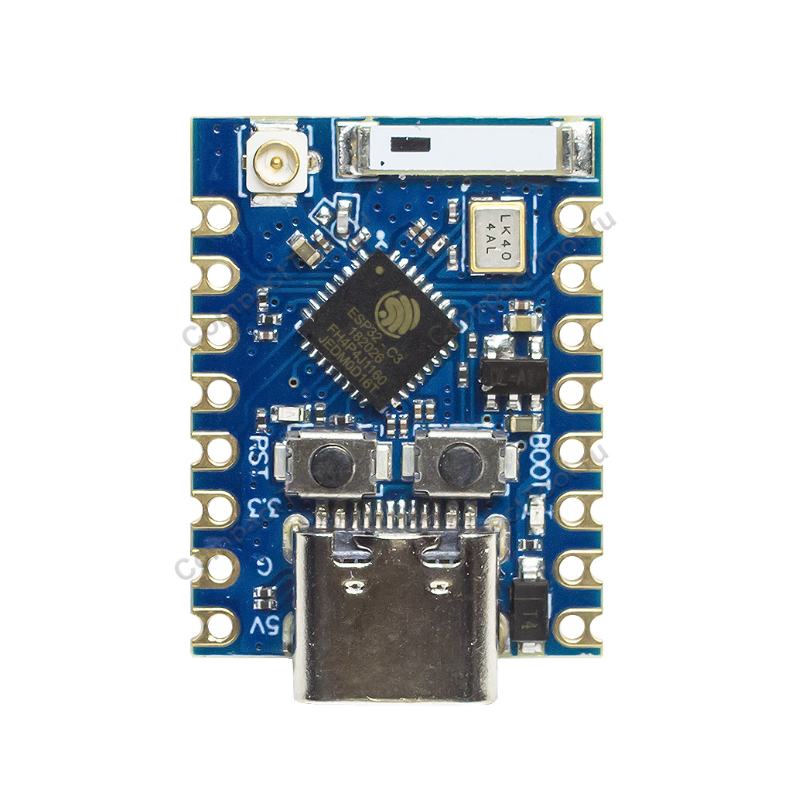
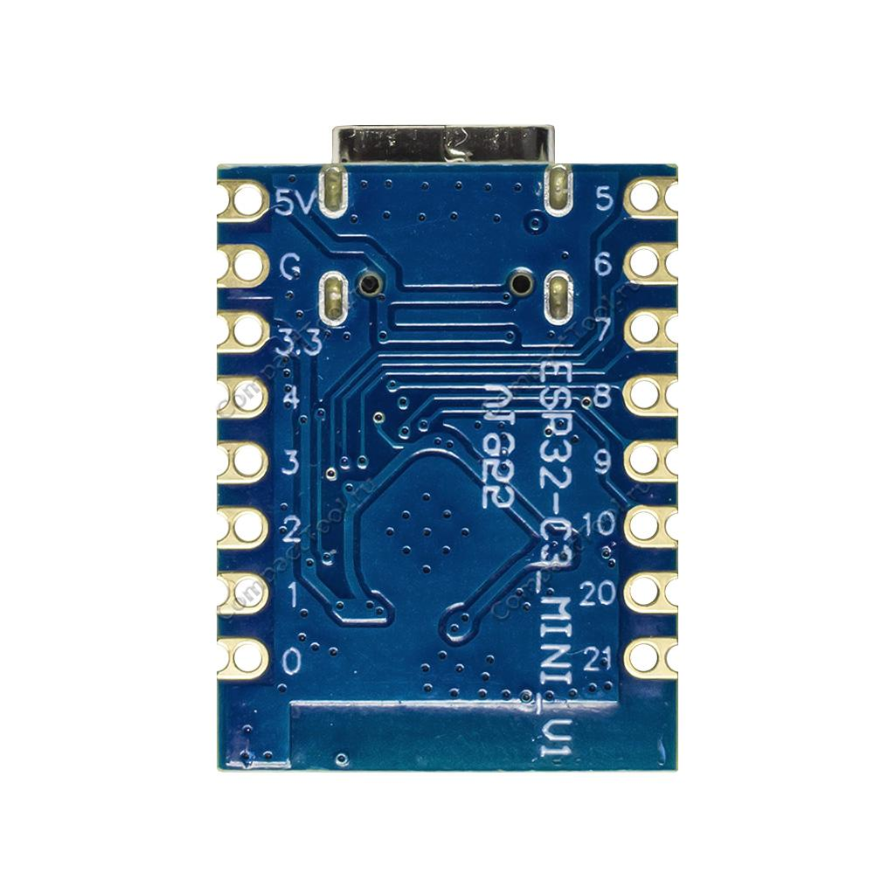
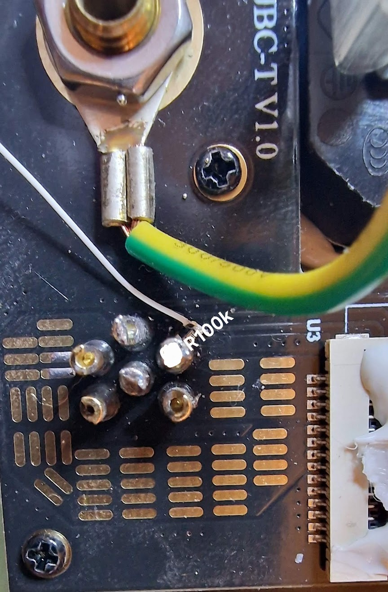
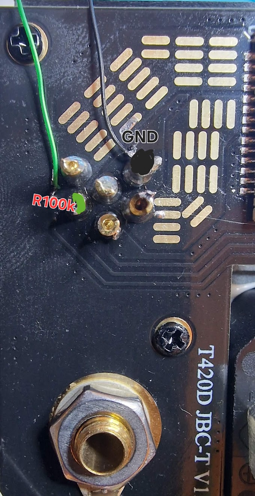
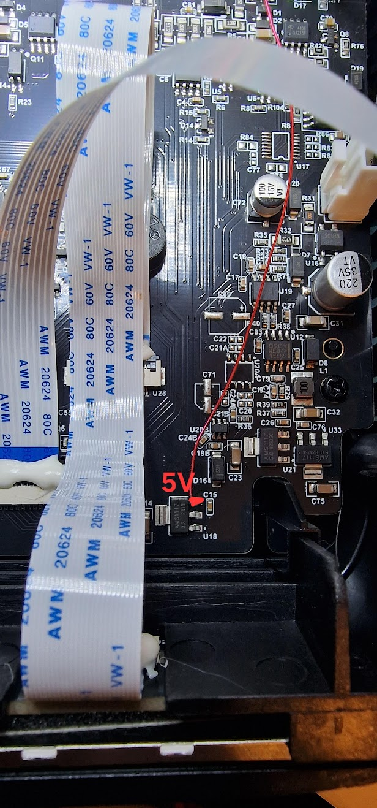
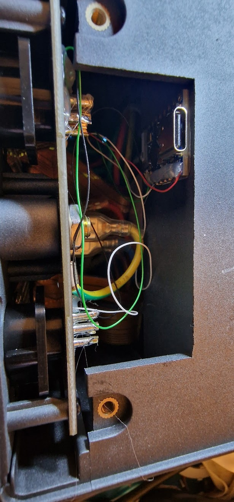

# Legacy Bridge Workspace

## 🔥 Legacy Bridge (LB)

Интеллектуальный мост между паяльной станцией и дымоуловителем.  
Автоматизация без замены оборудования.

## 🚀 Что это такое

Дымоуловитель не включается автоматически?  
Паяльник и фен не связаны между собой?

Legacy Bridge решает эту проблему без замены оборудования.

Это внешний модуль на базе ESP32, который автоматически управляет вытяжкой в зависимости от состояния паяльной станции и фена.

## 📖 История создания

Я использую оборудование Aixun в работе.

После покупки дымоуловителя Aixun ES02 выяснилось, что он не работает с паяльной станцией T420D, так как в ней отсутствует Wi-Fi модуль. Также не было нормальной интеграции с феном H312.

Фактически: оборудование есть, но взаимодействия между устройствами нет.

Было принято решение реализовать внешний модуль, который объединяет устройства и добавляет автоматизацию без замены техники.

Так появился Legacy Bridge.

## ⚙️ Функциональность

- Автоматическое управление дымоуловителем
- Реакция на состояние паяльника (SENSE)
- Реакция на работу фена (Wi-Fi / BLE)
- Регулировка мощности вытяжки
- Регулировка подсветки
- Автоматическое выключение по времени
- Веб-интерфейс управления

## 🧠 Принцип работы

- Состояние паяльника определяется по линии SENSE
- Состояние фена — по температуре
- Логика выполняется на ESP32
- Управление вытяжкой происходит автоматически

## 🧩 Аппаратная часть

- ESP32-C3 Pro Mini
- R1, R2 — 100 кОм
- C1, C2 — 100 нФ

<a href="assets/photos/system-overview.jpg" target="_blank"></a>
<a href="assets/photos/esp32-closeup.jpg" target="_blank"></a>

## 🔌 Схема подключения

```text
Signal 1 -> R1 100k -> GPIO1
GPIO1    -> C1 100nF -> GND

Signal 2 -> R2 100k -> GPIO3
GPIO3    -> C2 100nF -> GND

5V  -> ESP32 5V
GND -> ESP32 GND
```

<a href="assets/photos/t420d-sense-point-1.jpg" target="_blank"></a>
<a href="assets/photos/t420d-sense-point-2.jpg" target="_blank"></a>
<a href="assets/photos/t420d-5v-point.jpg" target="_blank"></a>

## 🔌 USB подключение

ESP32 подключается по USB только для первичной прошивки.

Дальнейшая работа:

- обновление по Wi-Fi (OTA)
- автономная работа без USB

## 🌐 Веб-интерфейс

Интерфейс сделан так, чтобы к нему не приходилось постоянно возвращаться.

### Что это даёт в работе

- Меньше шума на рабочем месте
- Вытяжка работает только тогда, когда это действительно нужно
- Меньше потери электроэнергии
- Нет постоянной работы “на всякий случай”
- Автоматизация без контроля
- Не нужно помнить включить или выключить вытяжку

### Что можно контролировать

`🎛 Управление`

- мощность дымоуловителя
- яркость подсветки

`🧠 Логика`

- задержка включения
- задержка выключения
- реакция на паяльник и фен
- температурные условия

`📡 Подключение`

- Wi-Fi сеть
- поиск и подключение устройств

`🛠 Система`

- логи
- reboot
- recovery
- reset

## 🚀 Live Demo

📌 Демо работает в браузере и показывает интерфейс в режиме эмуляции.

## 📡 Первый запуск

👉 https://serjio193.github.io/legacy-bridge/

Требуется Chromium-браузер (Chrome / Edge).

### Данные по умолчанию

- SSID: `LB-SETUP-XXXXX`
- Пароль: `lbxxxxx!2026`
- Логин: `admin`
- Recovery: `LB_RECOVERY`

### Генерация пароля

- `XXXXX` — последние 5 символов MAC (HEX, uppercase)
- `xxxxx` — те же символы в lowercase

## 📡 Сеть

После настройки:

- точка доступа отключается
- устройство работает в основной сети

## 🌡 Интеграция фена

Подключение:

- Wi-Fi
- Bluetooth (BLE)

Вытяжка включается по температуре.

## 🔐 Безопасность

- Прошивка подписана приватным ключом
- Устройство принимает только подписанные обновления
- Boot и Recovery защищены от записи по Wi-Fi

## 📦 Обновления

- OTA через Wi-Fi
- Пакет: `update.lbpack`
- Источник: GitHub Releases

## 🧪 Поддерживаемое оборудование

- Aixun T420D
- Aixun H312
- Aixun ES02
- JBC-совместимые станции (частично)

## 🚧 План развития

Планируется:

- Поддержка slave-устройств на ESP32
- Интеграция дополнительного оборудования (Aixun, JCID и др.)

## 👨‍🔧 Автор

Serjio193  
Embedded developer

Проект основан на практическом опыте ремонта.

## 🎯 Цель проекта

Создать простой и надёжный инструмент, автоматизирующий рабочий процесс.

## ❤️ Поддержка

[](https://paypal.me/SerhiiTarnopovych)
[](#usdt-trc20)

<details id="usdt-trc20">
<summary>USDT TRC20</summary>

Wallet: `TB4kzsHL3emLtdvDroNE9dEpMhUW6r3bTL`


</details>

## 🧷 Пример установки в T420D

<a href="assets/photos/t420d-case-placement.jpg" target="_blank"></a>

## 🧨 Итог

Legacy Bridge — это инструмент, который:

- убирает ручное управление вытяжкой
- объединяет оборудование
- делает рабочее место предсказуемым и удобным

## Structure

- `esp32_tes02_ctrl/` - PlatformIO firmware project (ESP32-C3)
- `ui/` - frontend source mirror used for sync into firmware LittleFS
- `security_private.pem` / `security_public.pem` - signing keys (local only, do not publish private key)

## Firmware release pipeline

- GitHub Actions workflow: `.github/workflows/release_firmware.yml`
- Builds signed `update.lbpack` and uploads it to GitHub Releases
- Release artifacts are signed with a private key, and signature is verified on-device before install
- Main firmware version is numeric: `v1 ... v99999`
- Device auto-update UI reads GitHub Releases and installs `update.lbpack`

## Online USB flasher page (bare ESP32-C3)

- Source: `flasher/index.html`
- Deploy workflow: `.github/workflows/pages_flasher.yml`
- Expected URL after Pages deploy:
  - `https://serjio193.github.io/legacy-bridge/`
- The page pulls versions from GitHub Releases and flashes full image set:
  - `bootloader.bin` (`0x0`)
  - `partitions.bin` (`0x8000`)
  - `firmware.bin` (`0x10000`)
  - `littlefs.bin` (`0x238000`)
  - `recovery.bin` (`0x300000`)
- Browser requirements:
  - Chromium browser (Chrome/Edge)
  - HTTPS context (GitHub Pages)

## Local canonical packaging command

```powershell
powershell -ExecutionPolicy Bypass -File esp32_tes02_ctrl\scripts\make_update_pack.ps1 -Env esp32c3
```

This command syncs `ui -> esp32_tes02_ctrl/data`, rebuilds firmware + LittleFS, signs binaries, and creates package.

## Detailed docs

See full technical guide:

- `esp32_tes02_ctrl/README.md`
